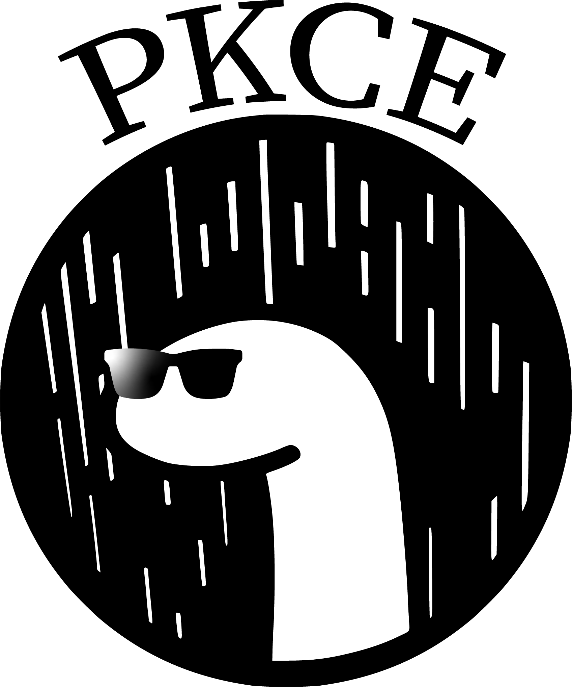

<div align="center">
    
    <h1>PKCE for Deno</h1>
    <p>
        <b>PKCE code verifier and challenge generator for Deno.</b>
    </p>
    <p>
        
        
        
        
        
    </p>
    <p>
        <b><a href="https://deno.land/x/pkce_deno">View on deno.land</a></b>
    </p>
    <br>
    <br>
    <br>
</div>

## 🚀 Quick Start

### Javascript

```js
import { create } from "https://deno.land/x/pkce_deno/mod.ts";
// OR import { create } from 'https://raw.githubusercontent.com/DiFronzo/pkce-deno/master/mod.ts';

const codePair = create();

// {
//   codeVerifier: 'tnsFvonDznrEvywCAryrzozCwmuAxEwDFtDzxnvzErCmumwqrAAEtrtvwCsEzBFvxFnmuvByDBqrnvwsEovtBEosBvtDEzABCDDCutEuwnFAomotrxFuolzwAsEvzBEs',
//   codeChallenge: '4BEE-zDiqCqq89S3rTimRMYZA-oVanxBqrhQ6TnZTZc'
// }
```

### Typescript

```ts
import { create } from "https://deno.land/x/pkce_deno/mod.ts";
// OR import { create } from 'https://raw.githubusercontent.com/DiFronzo/pkce-deno/master/mod.ts';

interface CodePair {
  codeVerifier: string;
  codeChallenge: string;
}

const codePair: CodePair = create();

// {
//   codeVerifier: 'tnsFvonDznrEvywCAryrzozCwmuAxEwDFtDzxnvzErCmumwqrAAEtrtvwCsEzBFvxFnmuvByDBqrnvwsEovtBEosBvtDEzABCDDCutEuwnFAomotrxFuolzwAsEvzBEs',
//   codeChallenge: '4BEE-zDiqCqq89S3rTimRMYZA-oVanxBqrhQ6TnZTZc'
// }
```

## 🏗️ Contributing

Contributions are what make the open source community such an amazing place to
be learn, inspire, and create. Any contributions you make are **greatly
appreciated**.

1. Fork the Project
2. Create your Feature Branch (`git checkout -b feature/AmazingFeature`)
3. Commit your Changes (`git commit -m 'Add some AmazingFeature'`)
4. Make sure that `deno test` and `deno fmt` do not generate errors
5. Push to the Branch (`git push origin feature/AmazingFeature`)
6. Open a Pull Request

### Licensing

Icon library by [Icons8](https://icons8.com/).

This project is under [MIT License](/LICENSE).
